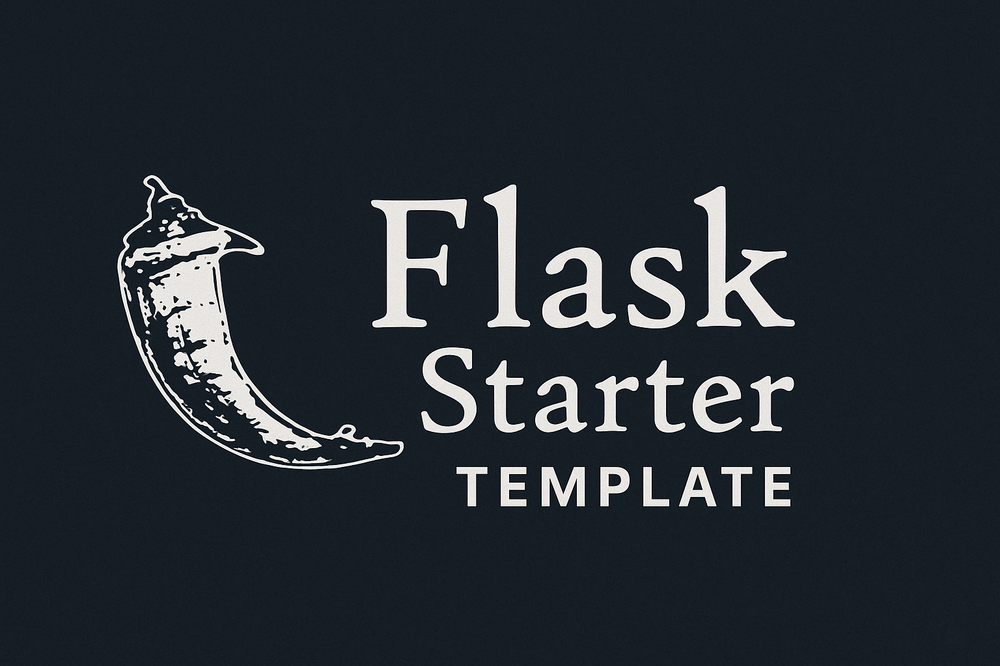

# 🧪 Template Flask Universel - Local + o2switch

<p align="center">
  
</p>

<p align="center">
  
  
  
  
</p>

Ce template est conçu pour permettre un développement local rapide ainsi qu’un déploiement propre sur o2switch via Passenger.

---

## ✅ Structure

- `app/` : code source Flask
- `templates/` : vues HTML Jinja2
- `static/` : fichiers CSS/JS/images
- `run.py` : lancement local
- `passenger_wsgi.py` : déploiement o2switch
- `.env` : configuration locale

---

## ▶️ Lancer en local

```bash
python -m venv venv
source venv/bin/activate
pip install -r requirements.txt
python run.py

## 🌐 Déployer sur o2switch

1. Aller dans cPanel > Setup Python App
2. Root: dossier de ce projet
3. Startup file: passenger_wsgi.py
4. Entry point: application
5. Installer les dépendances avec `pip install -r requirements.txt` (via l'outil ou SSH)
6. Redémarrer l'app depuis cPanel
